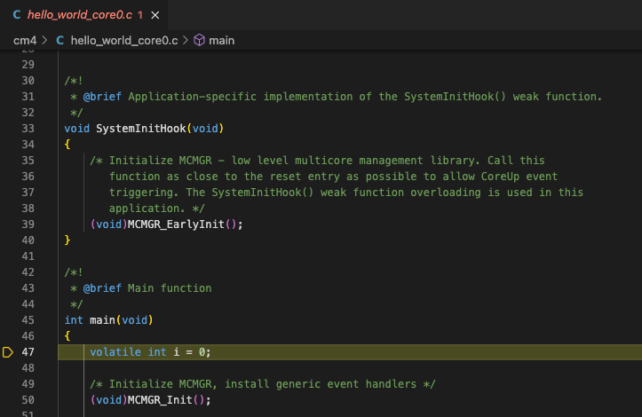

# Start debugging

There are two ways to start a debug session:

1. In the **CMSIS view** , click on the **Debug** icon
   . Depending on the number of configurations in your `launch.json`
   file, you will be asked to select a configuration for the debug session.

2. In the **Run and debug view** , click the **Play** icon
   next to the selected debug connection . The debug starts with the selected
   configuration.

The debugger loads the application program and executes the startup code. When program execution stops (by default at `main`),
the source code opens at the next executable statement which is marked with a yellow arrow in the editor:

Most editor features are available in debug mode. For example, developers can use the Find command and can correct program
errors.

## Flash and run

If you do not wish to enter a debug session, you can issue a flash download only, followed by a reset of the device.

In the **CMSIS view** , click on the **Run** icon
.
