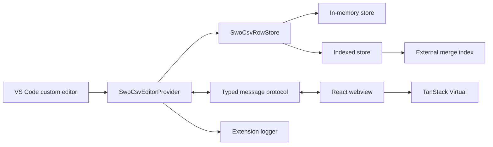
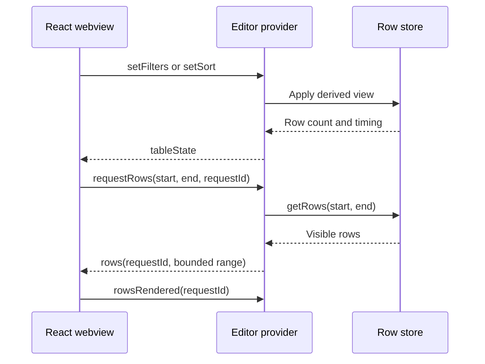

# SWO CSV Viewer Architecture

The SWO CSV viewer is a read-only VS Code custom editor. The Extension Host is
authoritative for file access, parsing, filtering, sorting, and row ordering.
The React webview requests and renders only the visible rows plus a small
overscan.

## System structure

## Editor integration

The extension contributes read-only custom-editor registrations backed by one
`SwoCsvEditorProvider` instance:

- `*.swo.csv`, `*.tb.csv`, and `*.tb-*.csv` use the table viewer
  by default.

VS Code owns editor selection and the native **Reopen With** and
**Open in Text Editor** actions. The feature contributes no duplicate editor
action commands.

Each resolved editor owns isolated row-store, filter, sort, file-watcher, and
message-handler state. The provider creates a Content Security Policy
restricted webview, chooses a row store, publishes table state, serves row
ranges, reloads changed resources, and validates selection messages before
logging them.

An incrementing generation prevents an older asynchronous load or view update
from replacing newer state. Row stores also reject obsolete derived views before
they replace active row ordering, so unfinished scans cannot overwrite a newer
filter or sort. The webview debounces filter input before sending it to the
host. The row store and file watcher are disposed with the webview panel.

## Storage modes

The provider selects a store from the source file size.

| File size | Store | Description |
| --- | --- | --- |
| Up to 20 MiB | In-memory | Parses the complete CSV and retains all rows and cells. Filtering creates matching row references and sorting reorders a copied reference list. |
| Over 20 MiB | Indexed | Leaves the CSV on disk and builds a compact index of every record's byte offset and length. Rows are read and parsed on demand. Filtering and sorting produce a display-order `Uint32Array` of source row IDs. |
| Over 300 MiB when sorted | External merge | Sorts bounded batches of keys and row IDs into temporary runs, then merges the runs into a disk-backed display-order index. |

The original CSV is never modified.

### Memory characteristics

An in-memory CSV can occupy substantially more memory than its file size
because JavaScript strings, arrays, and row objects have overhead. Clearing a
filter or sort releases its derived reference array for garbage collection,
while the parsed source table remains loaded.

The indexed store retains record locations and an optional display-order row
ID array instead of every cell. A one-million-entry `Uint32Array` occupies
about 4 MiB. Visible rows are read from their indexed byte ranges rather than
retained as a complete parsed table.

External merge sorting retains one bounded run batch and merge buffers in
memory. Temporary runs contain sort keys and row IDs, not complete CSV rows.

## Loading and parsing

The provider checks local file size before loading. Small files are parsed
completely. Large files are scanned in byte chunks to build record locations
while preserving quoted commas, escaped quotes, UTF-8 boundaries, and newlines
inside quoted fields.

For indexed files, a requested row range is loaded by reading the corresponding
byte span, decoding UTF-8, and parsing the records. Adjacent records are grouped
into one read.

Non-local URI schemes use `vscode.workspace.fs`, preserving compatibility with
remote and contributed file-system providers. These resources use the
in-memory parsing path because Node.js file handles and byte-offset reads apply
only to local files.

## Table model

The table model is independent of VS Code and the browser. It defines:

- Column names parsed from the first CSV record.
- Rows with immutable cell values and a stable `sourceRowIndex`.
- A malformed-row count for records normalized to the header width.
- Case-insensitive substring filters combined with logical AND.
- Stable, case-insensitive natural sorting by a CSV column or source row index.

Short rows are padded with empty cells. Excess cells are joined into the final
column. Sorting uses the source row index as its tie-breaker, preserving file
order for equal values. Clearing the sort restores filtered rows to file order.

The source row index is zero-based among non-empty data records; the header is
not counted. It remains stable across filtering and sorting.

## Filtering and sorting

Filtering precedes sorting. The indexed store must scan source records for
case-insensitive substring filters, then retains matching source row IDs. When
no value-column sort is active, matches are collected directly as numeric row
IDs without allocating sort-key objects. A descending source-row sort reverses
that compact list.

When a value-column sort is active, every filter update also extracts sort keys
and re-sorts the matching rows. This preserves the selected ordering but means
filter latency includes both the full source scan and the sort of the result.
The webview waits 250 ms after the latest filter keystroke before publishing
`setFilters`, preventing intermediate input values from starting redundant
million-row scans.

Sorting extracts the selected column value and source row ID. Files up to
300 MiB sort these entries in memory. Larger files create bounded sorted runs
and perform a k-way merge into a binary row-ID index under the system temporary
directory.

All storage modes use the same natural comparator and source-row tie-breaker,
so switching storage strategy does not change visible ordering.

The row-store update contract returns scan, sort, materialization, and result
count metrics. The provider logs operation start, host completion, and first
rendered rows for both filtering and sorting. External sorts additionally
report run creation and merge timings. These measurements distinguish host
data processing from range retrieval and webview rendering.

## Temporary files

External indexes and merge runs use a unique directory created by Node.js
`mkdtemp()` below `os.tmpdir()`. This selects the portable system or user
temporary location on Windows, macOS, and Linux. Child paths use `path.join()`.

The external row index owns its temporary directory and removes it recursively
when disposed. Reloading or closing the document disposes the active row store
and its temporary resources.

## Host-webview protocol

The host and webview share a discriminated TypeScript message protocol.

Host-to-webview messages:

- `tableState` publishes columns, filtered row count, loading state, parse
  warnings, and errors.
- `rows` returns a bounded range with its request identifier and starting
  offset.

Webview-to-host messages:

- `requestRows` requests the currently visible row interval.
- `setFilters` replaces the active per-column filters.
- `setSort` replaces or clears the active sort.
- `cellSelected` reports the source row, CSV column, column name, and raw value.
- `copyRows` requests clipboard serialization for compact display-index
  intervals.
- `rowsRendered` confirms that a requested range has rendered for performance
  diagnostics.

Request identifiers protect the webview from stale range responses. Every
table-state revision triggers a fresh visible-range request, including filter
changes that do not alter the result count.

## Webview

The browser bundle is a React application using TanStack Virtual. It retains
only the current visible row window. It owns filter input values, three-state
header sorting, resizable column widths, scroll position, virtual row
measurements, compact row-selection intervals, the logical row caret and range
anchor, the filter debounce timer, and the latest accepted request identifier.
Filter text updates immediately in the webview while the host receives only
the settled value.

The first `#` column displays the stable source row index. It is presentation
metadata rather than a CSV column, so CSV column indices remain unchanged in
filtering and selection messages.

## Selection boundary

Multi-row selection is webview-local navigation state. It is represented by
normalized display-index intervals rather than a set of source rows, so large
contiguous selections have constant memory cost. Pointer and keyboard
navigation maintain a logical caret and range anchor. TanStack Virtual scrolls
the caret into view while focus remains on the persistent grid container, so
virtual row unmounting does not discard keyboard focus.

Filtering, sorting, and source reloads change display-index meaning and
therefore clear row selection. Hiding the editor does not clear selection or
scroll state because the custom editor retains its webview context.

A clicked cell still emits a singular integration event rather than the full
row selection. The webview sends its source coordinates and value to the
provider. The provider reads the authoritative source row and verifies the row,
column name, and value before writing an extension log event. Invalid or stale
cell events are discarded with a warning.

Ctrl/Cmd+C sends the selected display-index intervals to the provider. The
provider validates their normalized bounds, reads rows from the active store
in bounded batches, serializes data cells as CSV in current display order, and
writes one CRLF-delimited value to the VS Code clipboard. Clipboard exports are
limited to 50 MiB to avoid exhausting extension-host memory; larger selections
show a warning without publishing partial content. The synthetic `#` column is
excluded. A reload or panel disposal cancels clipboard publication.

## Build boundaries

The Extension Host and browser code compile as separate targets:

- The root TypeScript project excludes `src/webviews/**/*`.
- The webview TypeScript project includes the CSV viewer source.
- Webpack builds the provider into the Node.js extension bundle.
- A separate web-target bundle emits the viewer JavaScript and CSS under
  `dist/webviews`.

`@tanstack/react-virtual` is a runtime dependency of the browser bundle only.

## Invariants

- The Extension Host is authoritative for file content and derived row order.
- The webview never receives the complete table in one message.
- Filtering precedes sorting, and range slicing occurs last.
- A filter update reapplies the active sort to matching rows.
- Source row indices do not change when rows are filtered or sorted.
- CSV column indices exclude the synthetic `#` column.
- Storage mode does not change filter or sort semantics.
- The custom editor is read-only and never writes to the source CSV file.
- Cell-selection payloads are validated before future integrations consume
  them.
