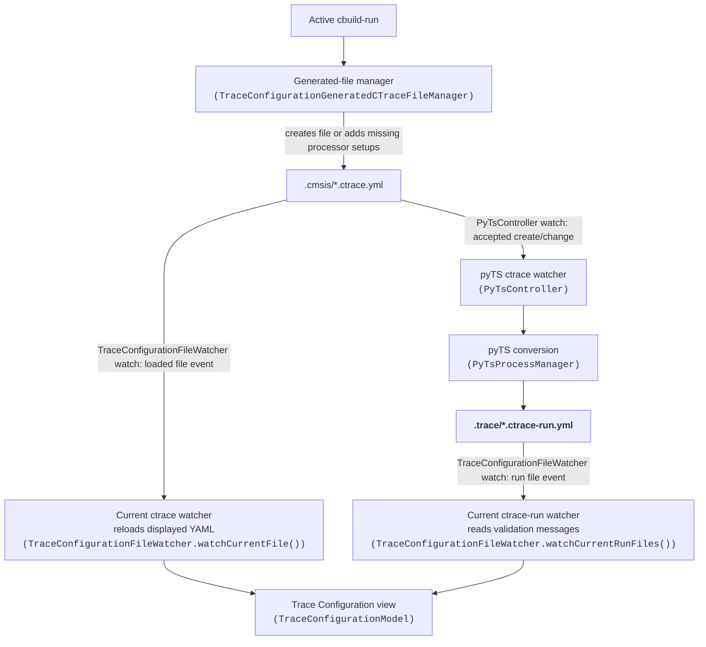
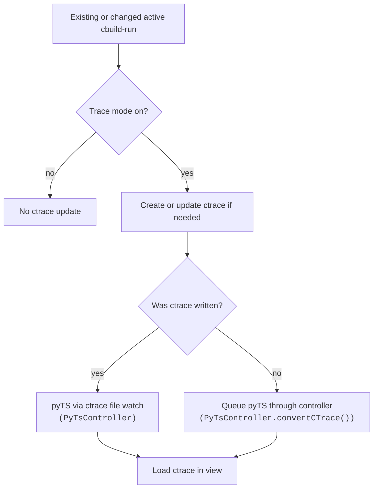
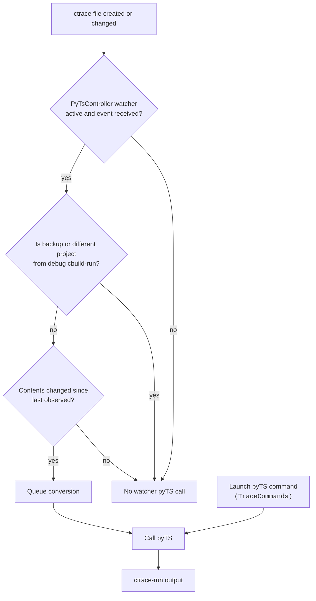
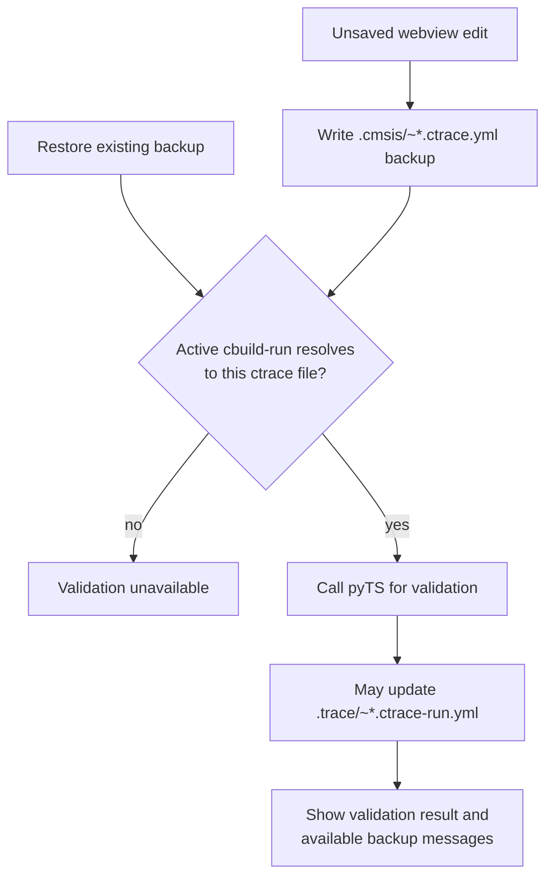

# Trace Configuration Update Triggers

These diagrams show how the extension updates `ctrace.yml` and
`ctrace-run.yml`, and when it calls pyTS. Production ctrace files live in
`.cmsis`; pyTS writes ctrace-run files in `.trace` under the active solution
folder.

## Production file path

The two ***ctrace*** watchers have different jobs.

- `PyTsController` starts pyTS conversion.
- `TraceConfigurationFileWatcher.watchCurrentFile()` reloads the displayed YAML.

The same `TraceConfigurationFileWatcher` class also watches the current
**ctrace-run** files. Each class named on a file-event edge registers its watch
through `FileWatchManager.addWatch()`.

The **loaded file** is the exact ctrace file currently open in the Trace
Configuration view. Its watcher receives create, change, and delete events for
that path; it reloads the displayed YAML only when the file's timestamp or
size differs from the last loaded version. The watcher is paused during
unsaved webview edits.

An **accepted create/change event** means the separate `PyTsController`
watcher is active, receives an event for a non-backup ctrace file matching
`.cmsis/[!~]*.ctrace.{yml,yaml}`, accepts it for the current debug context,
and finds that its contents differ from the last observed contents. That
watcher then queues pyTS conversion. It does not process delete events.

## cbuild-run events

At startup, after an active-solution or cbuild-index change, and when the
watched cbuild-run is created or changed, `TraceConfigurationFileWatcher`
forwards the active cbuild-run event. `TraceConfigurationGeneratedCTraceFileManager`
writes the matching ctrace file only when it is new or needs processor setup
entries.

For an unchanged existing ctrace file, every forwarded cbuild-run event queues
an explicit conversion, even when the production ctrace-run file already
exists. The cbuild-run input may have changed while the ctrace input stayed the
same, making the existing output stale. Equivalent requests that overlap are
coalesced by `PyTsController`; sequential events after a conversion completes
remain distinct. A ctrace write can still start pyTS through the separate
`PyTsController` watcher below.

## ctrace file events

The "Generate default ctrace" command (`TraceConfigurationCommands`), an
external edit, and a webview Save (`TraceConfigurationModel`) can all write
the production ctrace file. They do not call pyTS directly.

`TraceConfigurationGeneratedCTraceFileManager` may also write that file when
it processes a created or changed cbuild-run, including an existing one selected
after the active solution changes.

The ctrace create/change event starts pyTS only if `PyTsController` is already
watching and receives it.

The watcher observes `.cmsis/[!~]*.ctrace.{yml,yaml}` while the
trace-generation view setting is enabled. It matches ctrace names to the
debug session's cbuild-run filename and locates `.cmsis` under the active
solution folder when available. Without a `.cbuild-run.yml` session path, it
skips the project check.

`TraceConfigurationFileWatcher.watchCurrentFile()` reloads YAML only;
it is installed after a generated file is loaded and pauses during unsaved
webview edits.

## Unsaved webview edits

An edit remains in memory while `DebouncedTraceConfigurationBackup` writes a
backup beside the production ctrace file. Restoring an existing backup follows
the same validation path. `PyTsTraceConfigurationPrevalidator` checks that the
file is the active pyTS input before calling pyTS.

### ctrace-run observation

`TraceConfigurationFileWatcher.watchCurrentRunFiles()` watches both ctrace-run
filenames for the current ctrace file. `TraceConfigurationModel` reads
validation messages on create/change and clears them on delete. It uses
production messages when clean and backup messages while an unsaved edit is
active. Loading a clean ctrace file also reads an existing production
ctrace-run file without waiting for a watcher event.
